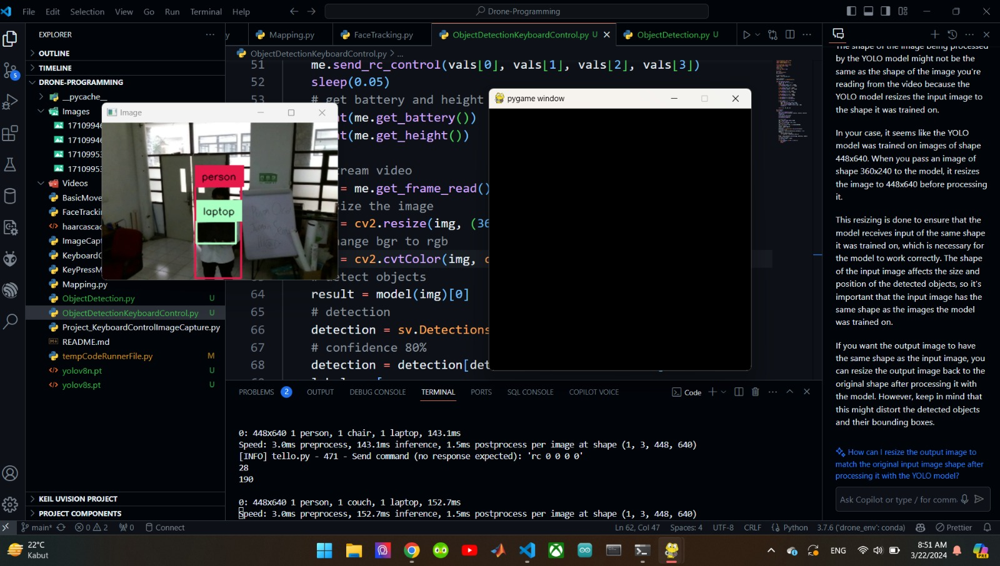
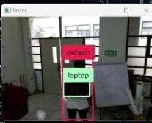
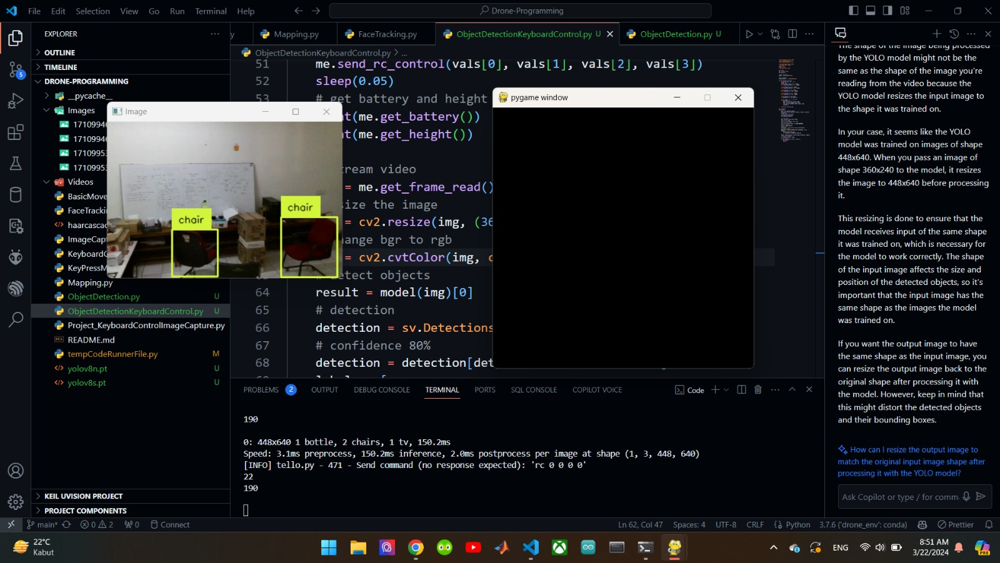
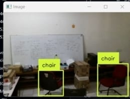

# Drone-Programming
Drone programming for computer vision, path planning, and ROS using DJI Tello

## Path Visualizer
Generate path visualizer of drone 

## Object Detection
Object detection using YOLOv8

